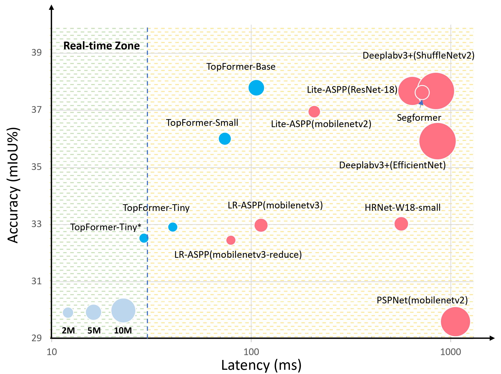

# Topformer: Token Pyramid Transformer for Mobile Semantic Segmentation

The official implementation of [Topformer: Token Pyramid Transformer for Mobile Semantic Segmentation]()

## Introduction

Although vision transformers (ViTs) have achieved great success in computer vision, the heavy computational cost makes it not suitable to deal with dense prediction tasks such as semantic segmentation on mobile devices. In this paper, we present a mobile-friendly architecture named Token Pyramid Vision Transformer (TopFormer). The proposed TopFormer takes Tokens from various scales as input to produce scale-aware semantic features, which are then injected into the corresponding tokens to augment the representation. Experimental results demonstrate that our method significantly outperforms CNN- and ViT-based networks across several semantic segmentation datasets and achieves a good trade-off between accuracy and latency.
<div  align="center">

</div>

## Requirements

- pytorch 1.5+
- mmcv-full==1.3.14


## Main results

Model | Params | FLOPs | mIoU    | Link
--- |:---:|:---:|:---:|:---: |
Topformer-T\* | 1.4 | 0.5 | 32.5
Topformer-T | 1.4 | 0.6 | 33.4 | 
Topformer-S | 3.1 | 1.2 | 36.5 |
Topformer-B | 5.1 | 1.8 | 38.3 | 

- \* indicates results are obtained with 448 × 448 resolution as input.

## Usage
Please see [mmsegmentation](https://github.com/open-mmlab/mmsegmentation/blob/master/docs/dataset_prepare.md) for dataset prepare.

Fro training, run:
```
sh tools/dist_train.sh local_configs/topformer/<config-file> <num-of-gpus-to-use> --work-dir /path/to/save/checkpoint
```
To evaluate, run:
```
sh tools/dist_test.sh local_configs/topformer/<config-file> <checkpoint-path> <num-of-gpus-to-use>
```

## Acknowledgement

The implementation is based on [MMSegmentation](https://github.com/open-mmlab/mmsegmentation/tree/master/configs/segformer)

## Citation

if you find our work helpful to your experiments, please cite with:
```

```


