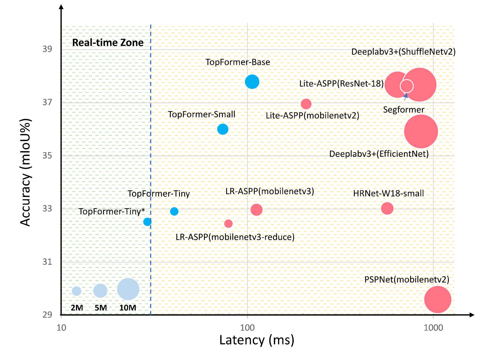

# TopFormer: Token Pyramid Transformer for Mobile Semantic Segmentation

Paper Links: [TopFormer: Token Pyramid Transformer for Mobile Semantic Segmentation](https://arxiv.org/abs/2204.05525) (CVPR 2022)

by [Wenqiang Zhang\*](), [Zilong Huang\*](https://speedinghzl.github.io/), [Guozhong Luo](), [Tao Chen](https://scholar.google.com.sg/citations?hl=en&user=w3OoFL0AAAAJ&view_op=list_works&sortby=pubdate), [Xinggang Wang](https://xinggangw.info/)<span>&#8224;</span>, [Wenyu Liu](http://eic.hust.edu.cn/professor/liuwenyu/)<span>&#8224;</span>, [Gang Yu](https://scholar.google.com/citations?user=BJdigYsAAAAJ&hl=zh-CN), [Chunhua Shen](https://cshen.github.io/).
>
>(\*) equal contribution, (†) corresponding author.
>

## Introduction

Although vision transformers (ViTs) have achieved great success in computer vision, the heavy computational cost makes it not suitable to deal with dense prediction tasks such as semantic segmentation on mobile devices. In this paper, we present a mobile-friendly architecture named **To**ken **P**yramid Vision Trans**Former**(**TopFormer**). The proposed TopFormer takes Tokens from various scales as input to produce scale-aware semantic features, which are then injected into the corresponding tokens to augment the representation. Experimental results demonstrate that our method significantly outperforms CNN- and ViT-based networks across several semantic segmentation datasets and achieves a good trade-off between accuracy and latency.

<div  align="center">

</div>

<font size=1>The latency is measured on a single `Qualcomm Snapdragon 865` with input size `512×512×3`,  only an `ARM CPU` core is used for speed testing. *indicates the input size is `448×448×3`.</font>

## Updates

- **04/23/2022**: TopFormer backbone has been integrated into [PaddleViT](https://github.com/BR-IDL/PaddleViT), checkout [here](https://github.com/BR-IDL/PaddleViT/tree/develop/image_classification/TopFormer) for the 3rd party implementation on Paddle framework!

## Requirements

- pytorch 1.5+
- mmcv-full==1.3.14


## Main results
The classification models pretrained on ImageNet can be downloaded from [Baidu Drive](https://pan.baidu.com/s/1YdrU-5Z_EtL2LiSQycRO3w)/[Google Drive](https://drive.google.com/drive/folders/1NLz3QCDbaXJ2DeGxLPUfupZZbojceDJM?usp=sharing).

**ADE20K**

Model | Params(M) | FLOPs(G) | mIoU(ss)    | Link
--- |:---:|:---:|:---:|:---: |
TopFormer-T_448x448_2x8_160k | 1.4 | 0.5 | 32.5 | [Baidu Drive](https://pan.baidu.com/s/1_Mvi1hyXXfBB4udkJlAiDA), [Google Drive](https://drive.google.com/file/d/1HsdinQHVKGzi8INJy29L48Ho1MmIeCZN/view?usp=sharing)
TopFormer-T_448x448_4x8_160k | 1.4 | 0.5 | 33.4 | [Baidu Drive](https://pan.baidu.com/s/1XU43DLbEDfer8ppA9B0GxQ), [Google Drive](https://drive.google.com/file/d/1UW6kmt5oxssxHylGaZg5CByP7xcFrOcF/view?usp=sharing)
TopFormer-T_512x512_2x8_160k | 1.4 | 0.6 | 33.6 | [Baidu Drive](https://pan.baidu.com/s/1-ElpFVrr1djpefKZlAb8GQ), [Google Drive](https://drive.google.com/file/d/11mxM2roRD-wXRYjw7YzKQVbQs2jsvYYw/view?usp=sharing)
TopFormer-T_512x512_4x8_160k | 1.4 | 0.6 | 34.6 | [Baidu Drive](https://pan.baidu.com/s/1QvhPenH1Jw4m2qB7dA-ppg), [Google Drive](https://drive.google.com/file/d/1OnS3_PwjJuNMWCKisreNxw_Lma8uR8bV/view?usp=sharing)
TopFormer-S_512x512_2x8_160k | 3.1 | 1.2 | 36.5 | [Baidu Drive](https://pan.baidu.com/s/1_lcmIShHX3q2IPvrQExfXg), [Google Drive](https://drive.google.com/file/d/16TJLt_lxJ-QvrDmYvhY_6vxRCYpyIN1n/view?usp=sharing)
TopFormer-S_512x512_4x8_160k | 3.1 | 1.2 | 37.0 | [Baidu Drive](https://pan.baidu.com/s/1zSzJWl_044P-hYCfCJRUIA), [Google Drive](https://drive.google.com/file/d/19041fMb4HuDyNhIYdW1r5612FyzpexP0/view?usp=sharing)
TopFormer-B_512x512_2x8_160k | 5.1 | 1.8 | 38.3 | [Baidu Drive](https://pan.baidu.com/s/1M0AVFE0NABsuWbgqRPVqNQ), [Google Drive](https://drive.google.com/file/d/1pYUUB4N6FVjXt1NKygtQis5WmhGECrNt/view?usp=sharing)
TopFormer-B_512x512_4x8_160k | 5.1 | 1.8 | 39.2 | [Baidu Drive](https://pan.baidu.com/s/11VQWW_qTKIyjRqyNwn9lVg), [Google Drive](https://drive.google.com/file/d/1m7CxYKWAyJzl5W3cj1vwsW4DfqAb_rqz/view?usp=sharing)
- `ss` indicates single-scale.
- The password of Baidu Drive is `topf`

## Usage
Please see [MMSegmentation](https://github.com/open-mmlab/mmsegmentation/blob/master/docs/en/dataset_prepare.md) for dataset prepare.

For training, run:
```
sh tools/dist_train.sh local_configs/topformer/<config-file> <num-of-gpus-to-use> --work-dir /path/to/save/checkpoint
```
To evaluate, run:
```
sh tools/dist_test.sh local_configs/topformer/<config-file> <checkpoint-path> <num-of-gpus-to-use>
```

To test the inference speed in mobile device, please refer to [tnn_runtime](tnn_runtime.md).

## Acknowledgement

The implementation is based on [MMSegmentation](https://github.com/open-mmlab/mmsegmentation).

## Citation

if you find our work helpful to your experiments, please cite with:
```
@article{zhang2022topformer,
  title     = {TopFormer: Token Pyramid Transformer for Mobile Semantic Segmentation},
  author    = {Zhang, Wenqiang and Huang, Zilong and Luo, Guozhong and Chen, Tao and Wang,  Xinggang and Liu, Wenyu and Yu, Gang and Shen, Chunhua.},
  booktitle = {Proc. IEEE Conf. Computer Vision and Pattern Recognition (CVPR)},
  year      = {2022}
}
```


